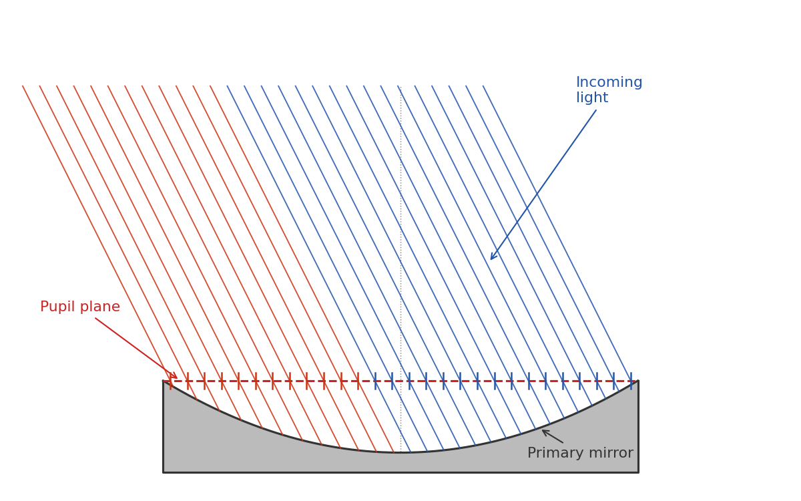
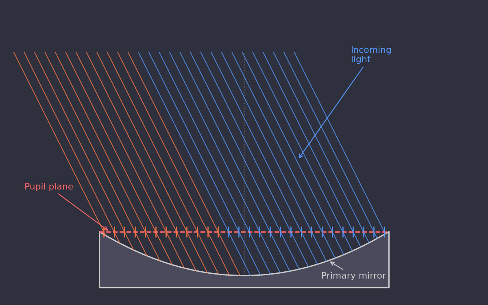
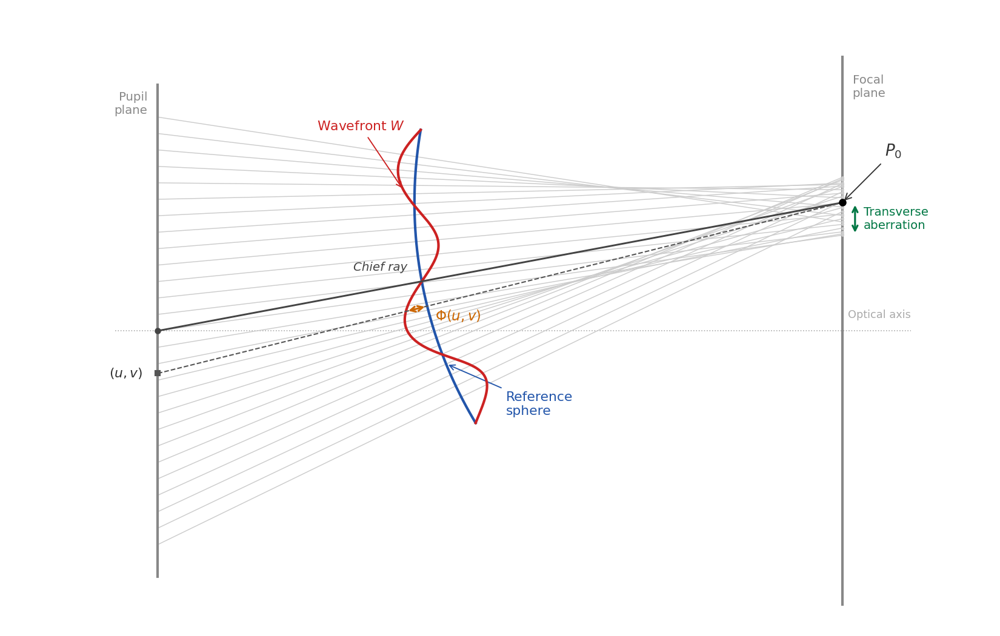
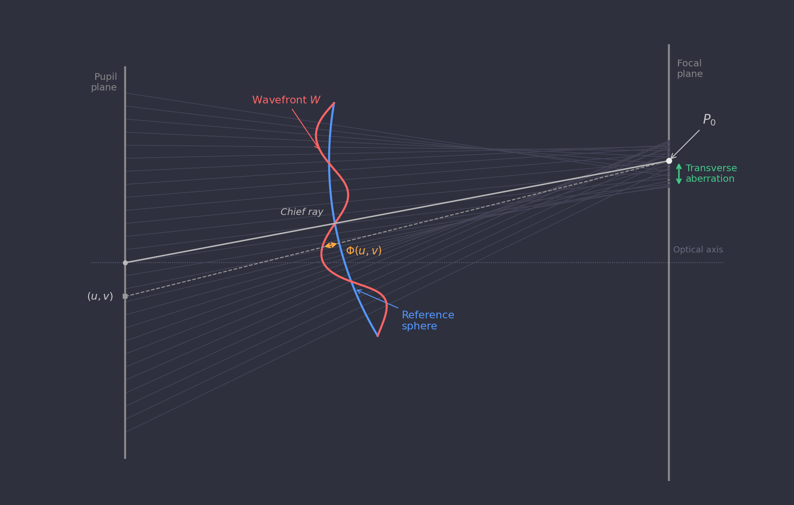
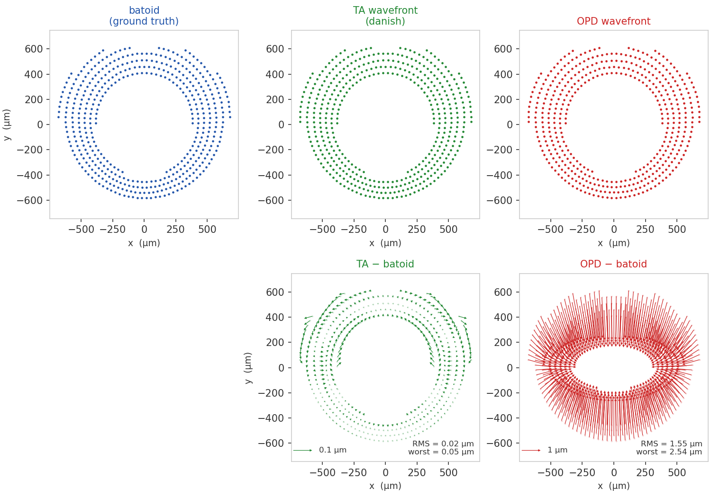
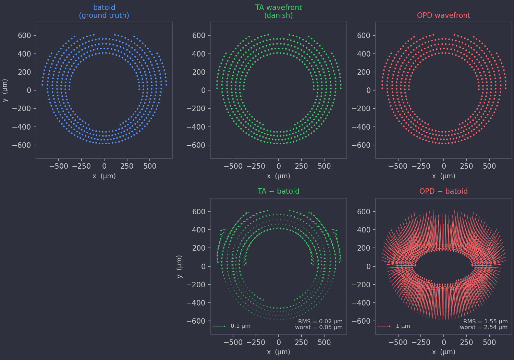
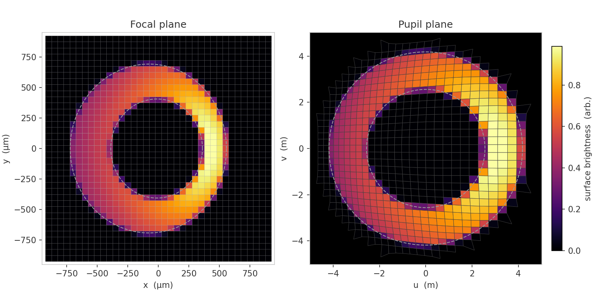
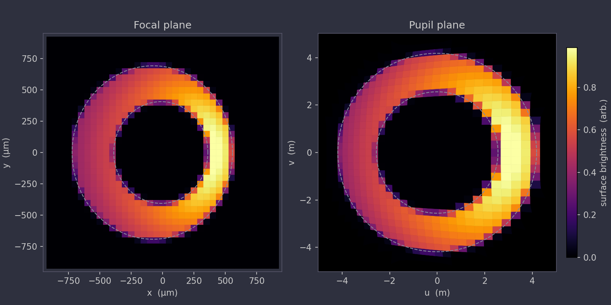
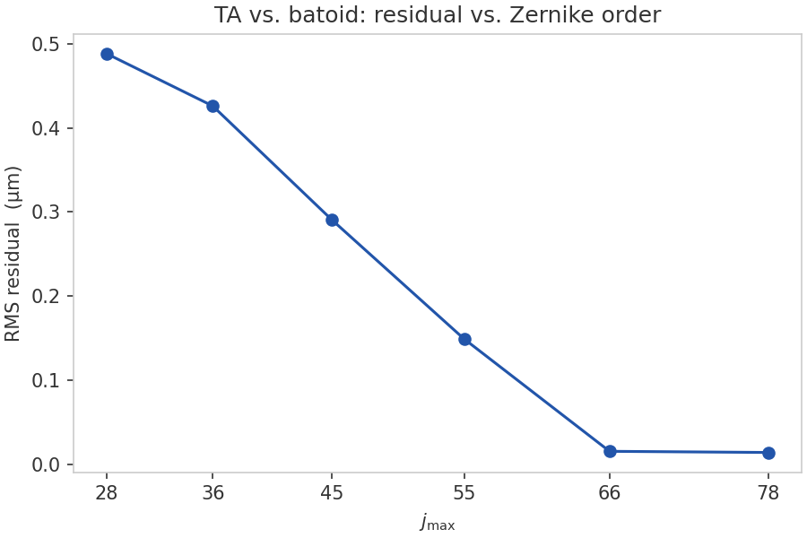
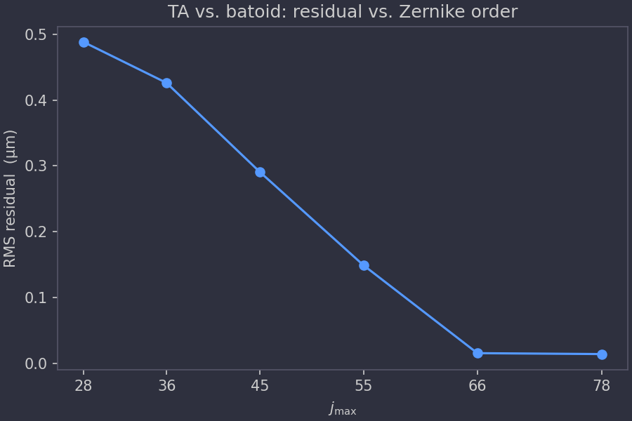

# Model Description

This section describes the mathematical foundations of the danish
geometric donut model.

## Pupil-to-focal mapping

### The pupil plane

For a wide-field astronomical telescope — such as the Vera C. Rubin
Observatory Simonyi Survey Telescope — the *entrance pupil* is the
plane that coincides with the rim of the primary mirror.  Note that
this is distinct from the curved mirror surface itself.  The
distinction matters: an incoming parallel beam of photons (from a
distant star) uniformly samples a flat plane, but does *not* uniformly
sample the curved mirror surface.

<figure>
  
  
  <figcaption>The pupil plane (dashed) coincides with the mirror rim.
  Incoming parallel rays from an off-axis source are uniformly spaced in
  the pupil plane (tick marks), but due to the beam angle they strike the
  curved mirror surface non-uniformly — more rays hit the right half
  (blue) than the left (red).  The flat pupil plane is therefore the
  natural coordinate domain.</figcaption>
</figure>

Note that we parameterize the wavefront over the *entrance* pupil rather
than the exit pupil.  The exit pupil is defined as the image of the
entrance pupil through the optical system.  For a paraxial system it
is a well-defined plane, but in a wide-field telescope the exit pupil
location shifts with field angle, so it is better thought of as an
approximately-located surface than a precise plane.  The entrance
pupil, by contrast, is exactly the flat plane at the mirror rim, and
is the natural domain for describing which parts of the aperture
contribute light to a given image and how each part produces optical
aberrations.  From here on, whenever we say pupil plane we specifically
mean the entrance pupil plane.

We use Cartesian coordinates $(u, v)$ in the pupil plane, with the
origin at the optical axis.  The annular aperture of the telescope
spans $R_\text{inner} \le \sqrt{u^2+v^2} \le R_\text{outer}$.

### Mapping to the focal plane

The fundamental conceit of danish is that we can form an efficient map
between the pupil plane and the focal plane by defining a scalar
function called the *transverse aberration wavefront* $W(u, v)$, which
has dimensions of length.  Without performing any explicit reflection
or refraction calculations, this function encodes the full effect of
the telescope optics: for a ray entering the pupil at $(u, v)$, the
corresponding position in the focal plane is

\begin{equation}\label{eq:pupil-to-focal}
x = -f \frac{\partial W}{\partial u}, \quad
y = -f \frac{\partial W}{\partial v},
\end{equation}

where $f$ is the telescope focal length.  This defines the function
[`danish.pupil_to_focal`][danish.factory.pupil_to_focal].  The inverse
transformation — from a focal-plane position back to the pupil — is
computed via Newton–Raphson iteration by
[`danish.focal_to_pupil`][danish.factory.focal_to_pupil].

In practice, the tip and tilt Zernike terms ($Z_2$ and $Z_3$) are held
at zero.  These terms shift the focal-plane position of the star
without changing its shape, which is instead accounted for by working
in focal-plane coordinates centered on the star or donut of interest.

### Wavefront convention

The wavefront $W(u, v)$ used by danish is the *transverse aberration*
(TA) wavefront.  This is a different quantity from the *optical path
difference* (OPD) wavefront $\Phi(u, v)$ that is more common in the
optics literature (e.g., Zemax output).

The OPD $\Phi(u,v)$ is defined as the optical path difference between
the ray through pupil point $(u, v)$ and a reference ray, measured as
the reference ray traverses a reference sphere.  The sphere is centered
on $P_0$ — the point where the reference ray intersects the focal
plane — with radius equal to the exit-pupil-to-focal-plane distance.
We use the chief ray (the ray through the center of the pupil) as the
reference ray.  In practice the computed wavefront is insensitive to
the exact value of the reference sphere radius.

<figure>
  
  
  <figcaption>Schematic of the OPD wavefront geometry for an off-axis
  source.  The reference sphere (blue arc) is centered on the reference
  point \(P_0\) where the chief ray intersects the focal plane.  The OPD
  \(\Phi(u,v)\) is the signed path-length gap between \(W\) and the sphere
  along the ray that goes through the pupil at \((u, v)\).  Background
  rays show how aberrations displace each ray from \(P_0\) in the focal
  plane; the green arrow illustrates the transverse aberrations of the
  rays, which are proportional to the local gradients of \(W\).
  </figcaption>
</figure>

The TA wavefront $W(u,v)$ is instead defined precisely such that
equation $\eqref{eq:pupil-to-focal}$ gives the correct focal-plane
position for the ray through $(u,v)$.  If the OPD $\Phi$ were
substituted in place of $W$, the predicted spot positions would be
less accurate.  The figure below illustrates the difference for a
representative LSST intra-focal donut with field angle (1.75°): the top
row shows spot diagrams from batoid raytracing, the TA wavefront
approach, and the OPD approach; the bottom row shows the residuals of
each prediction relative to batoid.  The TA wavefront achieves an RMS
spot accuracy of 0.02 µm, compared to 1.55 µm for the OPD wavefront.

<figure>
  
  
  <figcaption>Top row: spot diagrams for an intra focal donut at a
  1.75° off-axis field angle, computed by batoid raytracing (ground
  truth), the TA wavefront (danish), and the OPD wavefront.  Bottom
  row: residuals of each wavefront prediction relative to batoid, with
  separate quiver scales (0.1 µm reference for TA, 1 µm for OPD).  The
  TA approach is ~75× more accurate than OPD for this field angle.
  </figcaption>
</figure>

The TA wavefront coefficients can be computed from a batoid telescope
model using `batoid.zernikeTA()`.

### Axial position, defocus, and caustics

The wavefront $W(u,v)$ encodes not just the optical aberrations of the
telescope but also the axial position of the focal plane.  When the
detector (or the entire camera) is pistoned along the optical axis away
from the nominal focus, the $Z_4$ (defocus) coefficient of $W$ acquires
a large value, and other Zernike coefficients are also affected.  This
intentional defocusing is what creates the characteristic donut shape:
rays from the pupil annulus are spread over a large area on the
detector rather than converging to a point.

The forward transformation $\eqref{eq:pupil-to-focal}$ is defined for
any wavefront $W$, regardless of the axial position.  The *inverse*
transformation [`danish.focal_to_pupil`][danish.factory.focal_to_pupil]
is only well-defined when the mapping is injective — that is, when each
focal-plane point is reached by exactly one pupil ray.  Near focus the
mapping folds over itself and the inverse becomes multi-valued; the
boundary of this breakdown is a *caustic*.  The
[`danish.DonutFactory.is_caustic`][danish.factory.DonutFactory.is_caustic]
method checks for caustics for a given wavefront.

The surface-brightness model of the following section is likewise only
meaningful in the caustic-free regime: the Hessian determinant changes
sign at a caustic, indicating that the locally linearized area element
has collapsed to zero.

## Surface-brightness model

The illumination at a focal-plane pixel is proportional to the area of
the pupil annulus that maps onto that pixel.  The surface brightness
scales as the inverse determinant of the Jacobian of the
pupil-to-focal map,

$$
I(x, y) \propto \left| \frac{\partial(u,v)}{\partial(x,y)} \right| =
\frac{1}{f^2 \left| W_{uu}\, W_{vv} - W_{uv}^2 \right|} =
\frac{1}{f^2 \left| \det \mathbf{H} \right|},
$$

where $\mathbf{H}$ is the Hessian determinant of the wavefront, and
subscripts on $W$ denote second partial derivatives.

The figure below illustrates this geometrically.  Each square pixel in
the focal plane (left) maps back through the inverse wavefront gradient
to an irregular quadrilateral in the pupil plane (right).  Bright pixels
correspond to large quadrilaterals — they subtend a large area of the
pupil and collect more light — while dim pixels map to small ones.  The
color scale is shared between the two panels.  Large astigmatism and coma terms have been added to the wavefront to
make the variation in quadrilateral size and shape clearly visible.

<figure>
  
  
  <figcaption>Left: focal-plane pixels colored by surface brightness for
  a simulated LSST donut at field center, with artificially large
  astigmatism (2.5 µm) and coma (1.5 µm) added to
  make the effect clearly visible.  At field center the only aperture is
  the M1 annulus itself; at off-axis field angles additional vignetting
  from downstream optics can also be modeled.
  Right: the same pixels projected back into the pupil plane — each square
  becomes a quadrilateral whose area is proportional to the pixel
  brightness, directly illustrating the inverse-Jacobian relationship.
  Dashed circles mark the inner and outer M1 aperture in both planes.
  </figcaption>
</figure>

Pixel values are computed by multiplying this surface brightness by
the fraction of each pixel's area that falls within the field-angle
dependent vignetting mask.  This sub-pixel calculation assumes uniform
illumination within each pixel and simply scales the flux by the computed
enclosed area.

## Spot diagrams

For in-focus stellar images the surface-brightness model above is not
applicable — the mapping is near a caustic and the Hessian determinant
cannot be used to assign pixel fluxes.  Instead, danish models
in-focus PSFs via *spot diagrams*: a hexapolar grid of rays is sampled
across the pupil annulus and each ray is projected to the focal plane
using only the forward transformation $\eqref{eq:pupil-to-focal}$.
No inverse is required.

The resulting cloud of focal-plane points approximates the geometric
PSF.  [`danish.DonutFactory.spots`][danish.factory.DonutFactory.spots]
returns the focal-plane coordinates and weights of these rays;
[`danish.DonutFactory.spot_image`][danish.factory.DonutFactory.spot_image]
renders them onto a pixel grid by convolving with a Gaussian quadrature
kernel that accounts for the atmospheric PSF.

## Wavefront parameterization

The wavefront $W(u,v)$ is expanded in annular Zernike polynomials,

$$
W(u,v) = \sum_j a_j Z_j(u/R, v/R),
$$

where $R = R_\text{outer}$ is the normalization radius.  The fitting
parameterization — including multi-sensor double Zernike expansions and
sensitivity matrices — is described in [Fitting details](fitting.md).

### Zernike truncation order for LSST

The number of terms retained in the expansion controls how accurately
the TA wavefront reproduces full raytracing.  The figure below shows the
RMS residual between the TA prediction and batoid ground truth as a
function of $j_\text{max}$, evaluated at a number of truncation orders
from $j=28$ to $j=78$ for a representative LSST field angle of 1.75°.
The residual falls sharply at $j_\text{max}=66$ before improving only
negligibly at $j_\text{max}=78$.  For modeling LSST donuts, a good
choice for the maximum Noll index is 66.

<figure>
  
  
  <figcaption>RMS residual between the TA wavefront prediction and batoid
  raytracing as a function of Zernike truncation order \(j_\text{max}\),
  for an LSST intra-focal donut at a 1.75° off-axis field angle.
  Triangular-number orders are shown (each includes a complete radial
  order).  The residual drops by an order of magnitude between
  \(j_\text{max}=55\) and \(j_\text{max}=66\), then plateaus — motivating
  the choice of \(j_\text{max}=66\) as a good default for LSST.
  </figcaption>
</figure>
